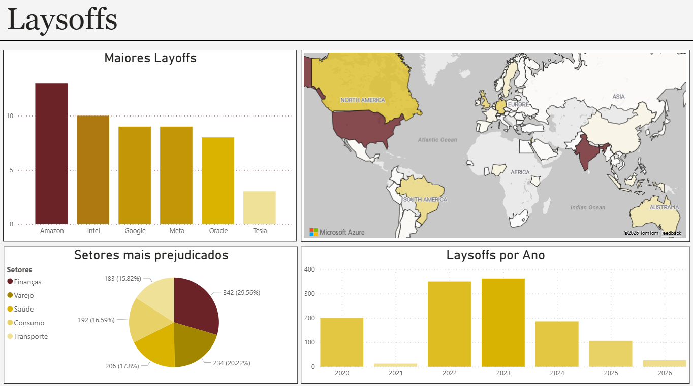

# Análise de Layoffs no Mercado Global

Este projeto apresenta um dashboard desenvolvido no Power BI com o objetivo de analisar layoffs ao longo dos últimos anos, explorando empresas, setores, distribuição geográfica e evolução temporal.

## Sobre o projeto

Nos últimos anos, os layoffs deixaram de ser eventos pontuais e passaram a refletir movimentos maiores do mercado, especialmente no setor de tecnologia.

A proposta deste projeto é transformar dados em uma visão clara e organizada, permitindo identificar padrões e entender melhor o comportamento dessas demissões ao longo do tempo.

## O que o dashboard apresenta

- Empresas com maior número de layoffs  
- Setores mais impactados  
- Distribuição geográfica das demissões  
- Evolução dos layoffs ao longo dos anos  

## Principais insights

- Houve um pico significativo de layoffs entre 2022 e 2023, indicando um período de ajuste após crescimento acelerado  
- Grandes empresas como Amazon, Google e Meta lideram em volume de demissões  
- O setor financeiro aparece como o mais impactado, seguido por varejo e saúde  
- A concentração geográfica destaca a força da América do Norte no cenário global  

## Curiosidades

- Mesmo empresas altamente consolidadas passaram por cortes relevantes, mostrando que o movimento foi estrutural e não isolado  
- O crescimento rápido antes de 2022 pode ter contribuído diretamente para os ajustes posteriores  
- Os layoffs não ficaram restritos à tecnologia, afetando múltiplos setores da economia  

## Visual do Dashboard

## Ferramentas utilizadas

- Power BI  
- Análise de dados  
- Visualização de dados  

## Próximos passos

- Aprofundar a análise por empresa  
- Incluir variáveis econômicas  
- Expandir o dataset para novos insights  
